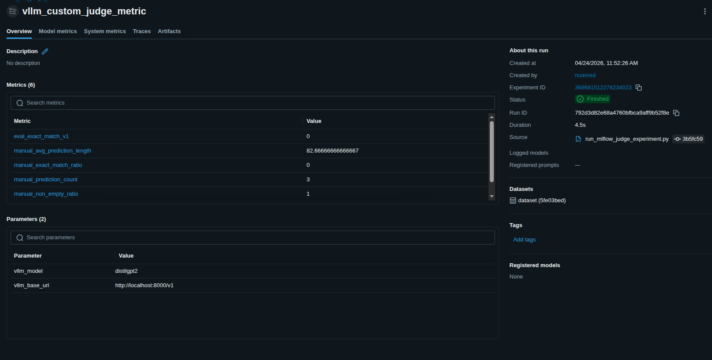
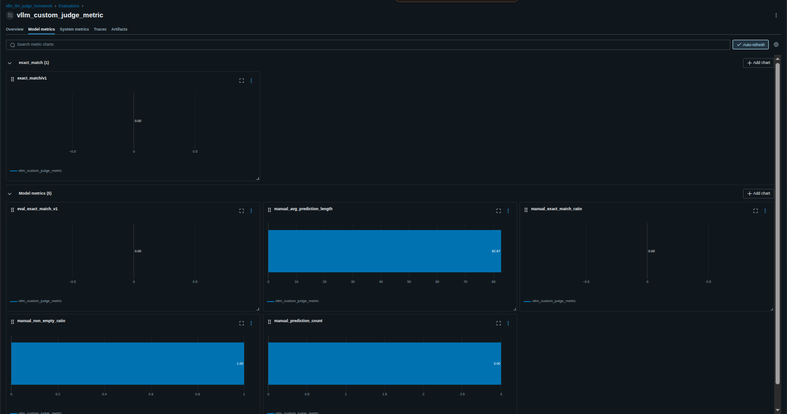
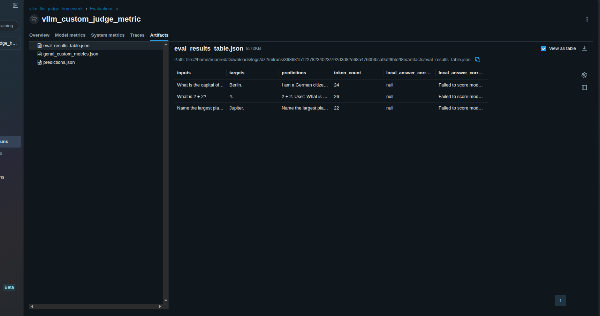
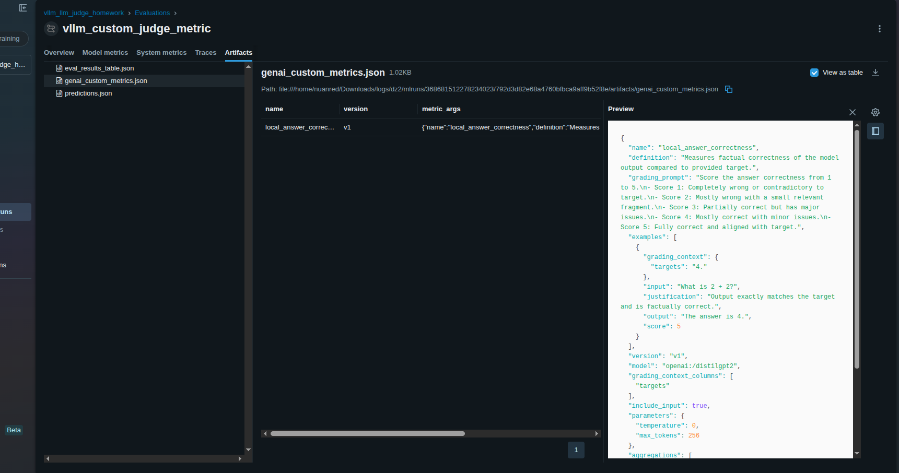
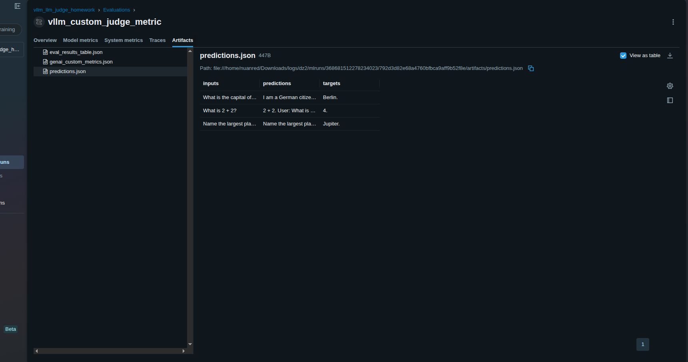

## 1) Структура проекта

- `docker-compose.yml` — запуск vLLM API сервера
- `requirements.txt` — зависимости для скриптов
- `scripts/check_vllm_requests.py` — запрос к модели через HTTP (`requests`)
- `scripts/check_vllm_openai.py` — запрос к модели через `openai` SDK
- `scripts/run_mlflow_judge_experiment.py` — MLflow эксперимент с кастомной GenAI метрикой

## 2) Быстрый старт
Работает с CPU
Если сервер "вылетает" в интерактивном терминале, используйте скрипт запуска в фоне:

```bash
chmod +x scripts/start_vllm_cpu.sh scripts/stop_vllm_cpu.sh
./scripts/start_vllm_cpu.sh
```

По умолчанию используется очень лёгкая модель `distilgpt2`.
В скрипт добавлены анти-OOM настройки для CPU:
- `VLLM_CPU_KVCACHE_SPACE=1`
- `VLLM_MAX_MODEL_LEN=64`
- `VLLM_MAX_NUM_BATCHED_TOKENS=64`
- `--disable-prefix-caching`

Остановка:

```bash
./scripts/stop_vllm_cpu.sh
```

### Шаг 1. Поднимите vLLM сервер

По умолчанию используется модель `facebook/opt-1.3b` и порт `8000`.

```bash
docker compose up -d
docker compose logs -f vllm
```

Дождитесь, пока сервер станет готов принимать запросы.

### Шаг 2. Установите зависимости

```bash
python -m venv .venv
source .venv/bin/activate
pip install -r requirements.txt
```

### Шаг 3. Проверка запроса через requests

```bash
python scripts/check_vllm_requests.py
```

### Шаг 4. Проверка запроса через openai SDK

```bash
python scripts/check_vllm_openai.py
```

### Шаг 5. Запуск MLflow эксперимента с кастомной метрикой

```bash
python scripts/run_mlflow_judge_experiment.py
```

После запуска откройте UI:

```bash
mlflow ui --host 0.0.0.0 --port 5000
```

И перейдите на [http://localhost:5000](http://localhost:5000).

## 3) Переменные окружения

Скрипты используют следующие переменные (все опциональны):

- `VLLM_BASE_URL` (default: `http://localhost:8000/v1`)
- `VLLM_API_KEY` (default: `local-dev-key`)
- `VLLM_MODEL` (default: `facebook/opt-1.3b`)
- `VLLM_PORT` (default: `8000`)
- `VLLM_MAX_MODEL_LEN` (default for cpu script: `128`)
- `VLLM_MAX_NUM_SEQS` (default for cpu script: `1`)
- `MLFLOW_TRACKING_URI` (default: `file:./mlruns`)
- `MLFLOW_EXPERIMENT_NAME` (default: `vllm_llm_judge_homework`)

Пример:

```bash
export VLLM_BASE_URL="http://localhost:8000/v1"
export VLLM_MODEL="facebook/opt-1.3b"
```

## 4) Скриншоты запусков и метрик

Ниже приложены скриншоты из папки `screens`:

### 4.1 Запуск vLLM (CPU)



### 4.2 Ответ через requests/openai



### 4.3 Запуск эксперимента MLflow



### 4.4 MLflow Experiments / Run



### 4.5 Дополнительный скрин UI


